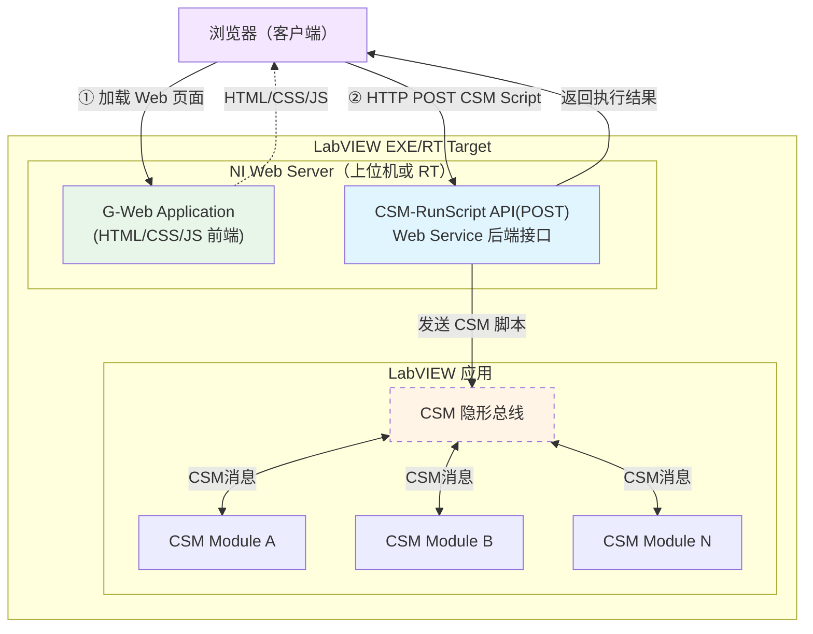

# G-Web Development with CSM

借助 CSM 框架，将 LabVIEW 应用发布为 Web 服务，通过 G-Web 前端在浏览器中进行远程监控与控制。只需暴露**一个** `CSM-RunScript` 接口，即可调用后端所有 CSM 模块的全部功能，无需为每个功能单独编写 Web Service VI。

适合部署在 NI cRIO/PXI 等 RT 目标上，用户无需安装客户端，直接通过浏览器访问局域网内设备。

> 详细文档：[CSM-Wiki - 基于 G-Web 的应用开发](https://nevstop-lab.github.io/CSM-Wiki/docs/examples/csm-gweb-development.html)

## 系统架构



## 项目结构

```text
G-Web-Development-with-CSM/
├── LabVIEW Project with Web Services/   # LabVIEW 后端工程
│   ├── WebService/
│   │   ├── Methods/
│   │   │   └── CSM-RunScript.vi         # 唯一的 Web Service 接口
│   │   ├── CSM/
│   │   │   └── CSM.vi                   # CSM 应用主模块
│   │   └── Startup Main.vi              # 启动入口
│   └── Test WebService.vi               # Web Service 测试 VI
└── G-Web Application/                   # G-Web 前端工程
    └── Web Application/                 # 可部署的 Web 应用
```

## CSM-RunScript 接口

| 项目 | 说明 |
| --- | --- |
| 方法 | `POST` |
| URL | `http://<host>:<port>/CSMWebService/CSM-RunScript` |
| 请求体 | CSM 脚本字符串（纯文本） |
| 返回值 | 执行结果字符串（纯文本） |

```
# 同步调用，等待返回结果
API: Read >> channel0 -@ SomeModule

# 异步调用，不等待返回值
API: Start ->| SomeModule
```

## 快速开始

1. **构建 CSM 应用**：在 LabVIEW 中完成基于 CSM 框架的业务逻辑模块
2. **打开后端工程**：用 LabVIEW 打开 `LabVIEW Project with Web Services/LabVIEW Project with Web Services.lvproj`，在 `CSM/CSM.vi` 中添加或修改业务模块
3. **打开前端工程**：用 G Web Development Software 打开 `G-Web Application/`，配置 HTTP 节点指向 `CSM-RunScript` 接口
4. **部署与运行**：右键 Web Service → **Deploy**，或直接运行 `Startup Main.vi`；构建 G-Web 应用并发布到 NI Web Server
5. **浏览器访问**：`http://<设备IP>:<端口>/CSMWebService/`

## 依赖项

- [Communicable State Machine (CSM)](https://github.com/NEVSTOP-LAB/Communicable-State-Machine) - NEVSTOP-LAB
- LabVIEW Application Web Server
- G Web Development Software（NI）
